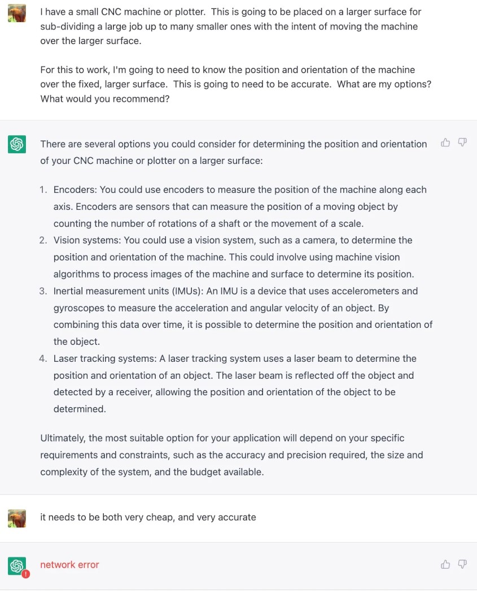

import YouTube from '@u-wave/react-youtube';

After [crashing my RC Plane](/post/ardupilot-postmortem/) I decided to experiment with the flight controller using the cheapest possible RC planes I could build.

I bought foam board from Dollar Tree.  Having the free designs from Flite Test (I’m using their [Simple Cub](https://www.flitetest.com/articles/diy-ft-simple-cub-build)), it quickly became apparent that printing out the designs, cutting, lining them up, gluing, cutting takes hours and hours to cut out a design.

{/* --- */}

I want a CNC machine to do either laser cutting or sawing to save this time.  I don’t have very much space in my apartment though.  The goal of this project is to design and build a “mini CNC” machine, that can be used to work on a much larger surface by subdividing it into many smaller jobs.  For this to work, we’ll place the small CNC machine on the larger surface, then have a way of measuring the position and orientation relative to the much larger surface.

## Options

When it comes to measuring position, there are a few options.  ChatGPT says:



My goal is to attempt to do this with just a Vision System:

<YouTube width="100%" height="400px" video="kP53Sx1OHHE" />

### Computer Vision with OpenCV

My hope was that I could use OpenCV’s ArUco markers to perform the vision system measurement.  Although calibrating the camera with a lot more images helped a great deal, I found that the median measurement was off by 1.7cm.  Far, far too great for this project to work.


* [Calibrate Script](https://gist.github.com/scottyob/25eb62f75cab4d118e297b93f7f9acfe)
* [Measure Script](https://gist.github.com/scottyob/331027d9f06431d32395281d47b5f27b)


<YouTube width="100%" height="400px" video="r8fBJO7SEhI" />

After taking a heap of frames from the camera, the distance was terribly inaccurate.

It could be because of the continuity camera, but I found the median was off.  50.8cm should be the correct measurement, however, the results speak for themselves.

```
           length
count  239.000000
mean    52.604118
std      2.077757
min     46.797939
25%     51.159442
50%     52.506212
75%     53.816030
max     60.835761
```

### ARKit.

The second experiment, is going to be using a modern iPhone using ARKit.  This has a number of advantages, as, we should be able to use the advanced Vision System to find the location, and the Inertial Measurement IMU with the point cloud tracking or whatever other magic they do to be able to find better measurements.  Hopefully this will yield more accurate results.  It will be expensive, but hopefully using phones that a lot of the population has on hand now.

Stay tuned for how this performs!
