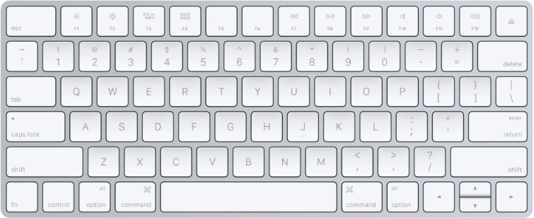
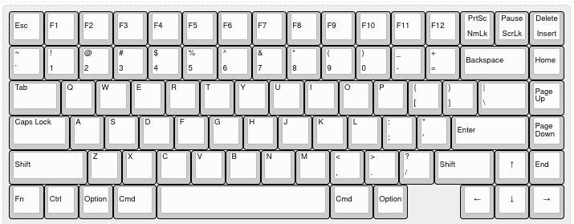
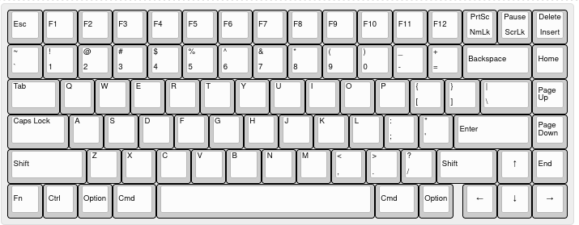
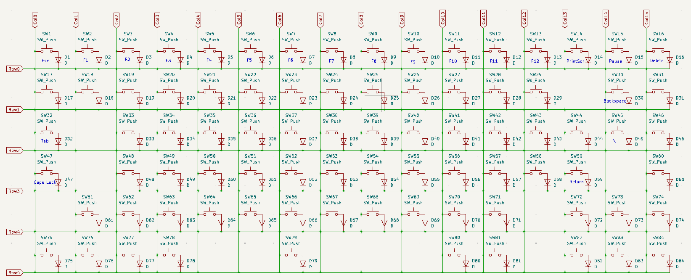
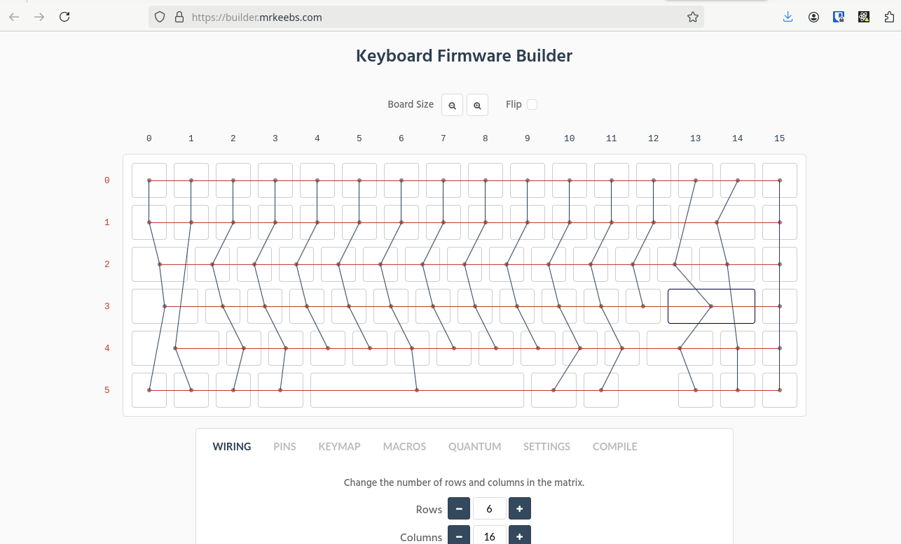

I've always wanted to build a mechanical keyboard from scratch.  I've always had a personal and work computer, and a KVM to switch between the two.  I'd try to avoid having any personal accounts logged into my work computer, but have found it too annoying to switch the entire display over when I want to check a quick e-mail or respond to a chat message.

{/* --- */}

The idea of this keyboard, is to embed a personal computer.  To have a small stretched display, and easy ways of switching between them.  I figure this would be the perfect project to make something I'll use all the time, and to learn some more electronics and design skills along the way!

### Initial Layout

I've been very used to the Mac keyboard layout, after having used this for some time, I wanted to keep the same layout and not have to muscle memory learn something new. 



The interesting things to note here, is that the function key is at the bottom left, I tend to use this a lot of "page up and down", and "home end" (function and arrow keys).  This is the biggest thing I'm concerned about.

Using the seeminly popular [Keyboard Layout Editor](http://www.keyboard-layout-editor.com/) tool, I could make something very similar, based on the KeyCool 86 template

```
[{a:6},"Esc","F1","F2","F3","F4","F5","F6","F7","F8","F9","F10","F11","F12",{a:5},"PrtSc\nNmLk","Pause\nScrLk","Delete\nInsert"],
[{a:4},"~\n`","!\n1","@\n2","#\n3","$\n4","%\n5","^\n6","&\n7","*\n8","(\n9",")\n0","_\n-","+\n=",{a:6,w:2},"Backspace","Home"],
[{a:4,w:1.5},"Tab","Q","W","E","R","T","Y","U","I","O","P","{\n[","}\n]",{w:1.5},"|\n\\",{a:6},"Page Up"],
[{a:4,w:1.75},"Caps Lock","A","S","D","F","G","H","J","K","L",":\n;","\"\n'",{a:6,w:2.25},"Enter","Page Down"],
[{w:2.25},"Shift",{a:4},"Z","X","C","V","B","N","M","<\n,",">\n.","?\n/",{a:6,w:1.75},"Shift",{a:7},"↑",{a:6},"End"],
["Fn","Ctrl","Option",{w:1.25},"Cmd",{a:7,w:5},"",{a:6,w:1.25},"Cmd","Option",{x:1.5,a:7},"←","↓","→"]
```


The problem with this I've found with the mac layout, is it's not very standard for the half height arrow keys, and the 5u spacebar would also mean custom spacers and custom keycaps.  So instead I'm going with something a tad more standard with a 6.25u spacebar:

```
[{a:6},"Esc","F1","F2","F3","F4","F5","F6","F7","F8","F9","F10","F11","F12",{a:5},"PrtSc\nNmLk","Pause\nScrLk","Delete\nInsert"],
[{a:4},"~\n`","!\n1","@\n2","#\n3","$\n4","%\n5","^\n6","&\n7","*\n8","(\n9",")\n0","_\n-","+\n=",{a:6,w:2},"Backspace","Home"],
[{a:4,w:1.5},"Tab","Q","W","E","R","T","Y","U","I","O","P","{\n[","}\n]",{w:1.5},"|\n\\",{a:6},"Page Up"],
[{a:4,w:1.75},"Caps Lock","A","S","D","F","G","H","J","K","L",":\n;","\"\n'",{a:6,w:2.25},"Enter","Page Down"],
[{w:2.25},"Shift",{a:4},"Z","X","C","V","B","N","M","<\n,",">\n.","?\n/",{a:6,w:1.75},"Shift",{a:7},"↑",{a:6},"End"],
["Fn","Ctrl","Option",{w:1.25},"Cmd",{a:7,w:6.25},"",{a:6,w:1.25},"Cmd","Option",{x: 0.25,a:7},"←","↓","→"]
```



## Electronic Design

Most of the electronics are tested from my [nRF52840 Devboard](/post/2024-08-08-nrf52840-devboard).  The only other thing of interest here is 


### Keyboard Matrix Design, and PCB.

I've read it's pretty simple to do MX keys that solder right into the PCB.  I'm following [ScottoKeebs Video](https://www.youtube.com/watch?v=8WXpGTIbxlQ) as a reference, and am using [His github resources](https://github.com/joe-scotto/scottokeebs/tree/main/Extras/ScottoKicad) for the footprints.

[MrKeebs KiCad generator](https://builder.mrkeebs.com/), or any plugin I tried didn't work for me, so I figured I'd do the array by hand:



I used the Mr Keebs tool as a reference for where my keys should be on the array though.


