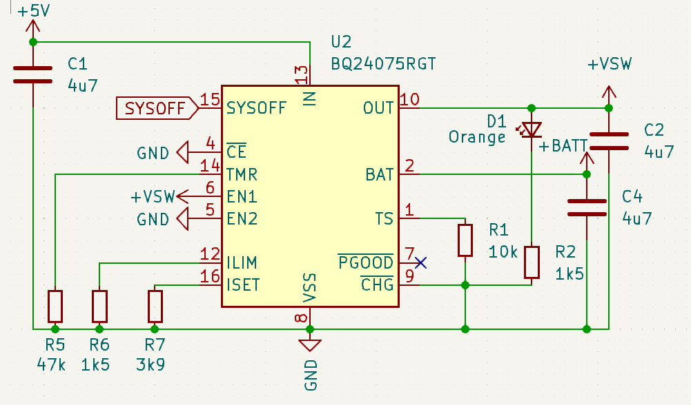

import a1_1 from "./arduino-board.png";
import a1_2 from "./arduino-schema.png";

import ImageGallery from 'react-image-gallery';

When working on my keyboard project, it's dawned on me how hard it is to build such a big project from scratch, and how I wish there was a breakout for the Holyiot 18010 nRF52840 controller, so, let's build one!  This will be a good test bed for the USB connection, and charge controller too!  Hopefully it can act as a proof of concept for everything that's going to go in my keyboard.

This page is to document my learnings from the [ZMK Design Guide](https://github.com/ebastler/zmk-designguide)

{/* --- */}

## Arduino Style Board
Initially I wanted the board to be a similar form factor to the rPi Pico, juts a bit longer.  As the Holyiot module is a bit thicc though, I ended up going with the old Arduino style form factor.  Little goal here is to make some (3.3v) shields pin compatible by mapping over the analog in compatible, power and ground pins.

<ImageGallery items={
    [
        a1_1,
        a1_2,
    ].map((img, i) => {return {original: img, thumbnail: img}})}
/>

## USB Connector
Going with a USB C Connector.  Some learnings:
- **Upstream Facing Port**: Client device port (this board)
- **Downstream Facing Port**: Host port (computer)

CC Ports:
- The Configuration Channel ports, are used to detect cable orientation and power supply capabilities.
- Putting a 5.1K resistor on both CC1 and CC2, signals to the source that we want 5V @ 3A.
- The source may not be able to supply 15W / 3A.  To check, we should be measuring the voltages.  [This Page](https://www.reclaimerlabs.com/blog/tag/usb) does a great job of explaining it without going into the full spec.


If we don't want to put any circuits in there to determine the voltage of these CC pins, we must make sure not to draw more than 500mA, 2.5W of current.

To be on the safe side, a 500mA fuse can be placed in line.  This inline with a dataline protector diode will help protect against any spikes in voltages above VBUS, or lower than GND.


## Battery

The battery I'm likely going to use in the keyboard is the [PL701488](https://a.co/d/eS76UHQ) battery as it's a fairly high capacity, with an interesting long and skinny form factor.

* **Size:**  88mm x 14mm x 7mm
* **Capacity:** 850mAh
* **Recharging Current:**  Standard 0.425A, max 0.85A
* **Discharge Current:**  Standard 0.425A, max 0.85A.

The things to watch out for here are that we don't try and charge too quickly, a max of 425mA would be ideal.

## Charge Controller

the Holyiot expects 5V on the VBUS pins IF it's connected to USB, but something closer to 3.3 on the VDFD_nRF.  As a test for how the keyboard would work, I want this devboard to have a charge controller on board.


I like the idea of the [BQ24075](https://www.ti.com/lit/ds/symlink/bq24075.pdf), as it allows me to be more dynamic on my power budget, allowing me to burst over the 500mA budget on my USB pins, and borrow from the 850mA max I can draw from the battery.  This may be useful if doing an animation with some LEDs for notifications or something??

Understanding the chosen resistors on the [ZMK Design Guide](https://github.com/ebastler/zmk-designguide), let's break down some math and pins used.



* **IN:**  5V, USB power after fuse and protections
* **OUT:**  +VSW, 5V OR Battery OUT
* **TS:**  Thermistor Input, temperature protection.  As we're relying on those built into the battery, spec sheet mentions connecting 10K resistor to VSS (Gnd)
* **PGOOD:**  Status output for battery ranges (we'll leave disconnected)
* **CHG:** Status that will go LOW when charging, Flash when safety timers are expired.
* **CE:** Enabled (tie to ground to leave enabled)

#### **TMR:**
This one is more interesting and is around safety timers.  I'm thinking we don't want to keep dumping current into a battery that's not reaching charge, and it's safer to shut it off.


From the spec sheet, Ktmr is typically 48 seconds, so with Rtmr being a 47KΩ resistor, we have:

#### Pre Charge:
```
Typical: 47 x 48 / 60 / 60 == 37 minutes
Min:  47 x 36 / 60 / 60 == 28 minutes
Max:  47 x 60 / 60 / 60 == 47 minutes
```

#### Max Charge:
```
Typical: 10 * 47 * 48 / 60 / 60 == 6 hrs, 16 minutes
Min: ... 4 hrs 40 minutes
Max: ... 7 hrs, 50 minutes
```

If we're charging at a very low rate of say 200mA of our 850mAh battery (to stay within the USB2 power budget), that's 4 hours and 15 minutes.  So still well able to stay within this safety timer budget.

#### **ISET:**

This resistor controls the current in the Fast Charge process.  The spec sheet mentions using resistors in the range of 590Ω to 8.9kΩ.

The formula for charge rate is:

I<sub>CHG</sub> = K<sub>ISET</sub> / R<sub>ISET</sub>

K<sub>ISET</sub>, or the "Fast Charge Current Factor", has a typical value of 890AΩ (min 795, max 975), so for charging at our desired say 230mA rate, with a bit of algebra:

I<sub>CHG</sub> = 890 / R<sub>ISET</sub>
```
0.23 = 890 / 9
0.23R = 890
R = 890 / 0.23
R = ~3.8K
```

The 3.9K resistor also works out as just over 228mA, well under the standard charge rate of the selected battery above, and well within the 500mAh power budget.
(890 / 3900)

#### **EN:**
The EN pins limit the input current.  With EN2 HIGH and EN1 LOW, this is a USB 500mA mode.  When EN2 is HIGH, and EN1 is LOW, that's when we use ILIM to determine draw.

#### **ILIM:**

This one is a little hazy for me.  It controls the input current, but, why we'd want to select the reference 1.5K resistor I don't understand where this value comes from.  As the docs talk about a 3.6V battery with R<sub>ILIM</sub> value of 1.5K, I'll leave it as that.

#### **SYSOFF:**
> Connect SYSOFF High to turn OFF the FET connecting the battery to the system output... Connect SYSOFF LOW for normal operation

I read this as as can trigger it HIGH, and the battery will be disconnected, and switched off.

It looks like the idea behind the use of SYSOFF in the reference circuit is to allow the battery to be used when the USB port is connected.  I've been playing around in [this simulation](https://tinyurl.com/2clgfspf) to play with this


### The Rest

The only other parts on this board are a regulator and voltage divider for battery capacity monitoring!  I'll update this post with a github link to the board soon, BOM, and my ventures on soldering this little beast
