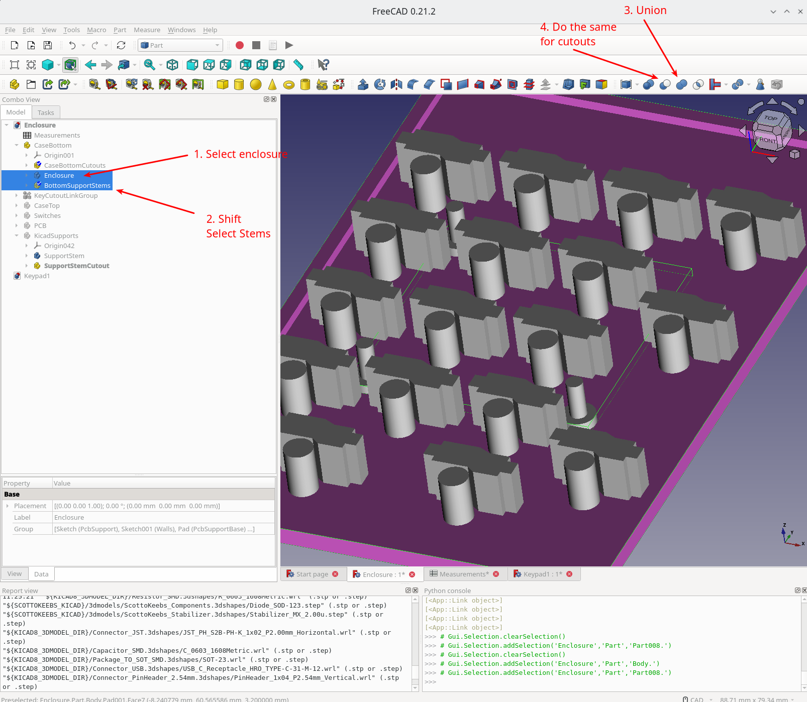

I've always wanted to build a mechanical keyboard from scratch.  I've always had a personal and work computer, and a KVM to switch between the two.  I'd try to avoid having any personal accounts logged into my work computer, but have found it too annoying to switch the entire display over when I want to check a quick e-mail or respond to a chat message.

{/* --- */}

import { Gist } from 'gist-react';


The idea of this keyboard, is to embed a personal computer.  To have a small stretched display, and easy ways of switching between them.  I figure this would be the perfect project to make something I'll use all the time, and to learn some more electronics and design skills along the way!

## Keyboard Layout

I've been very used to the Mac keyboard layout, after having used this for some time, I wanted to keep the same layout and not have to muscle memory learn something new. 


The interesting things to note here, is that the function key is at the bottom left, I tend to use this a lot of "page up and down", and "home end" (function and arrow keys).  This is the biggest thing I'm concerned about.

Using the seeminly popular [Keyboard Layout Editor](http://www.keyboard-layout-editor.com/) tool, I could make something very similar, based on the KeyCool 86 template

```
[{a:6},"Esc","F1","F2","F3","F4","F5","F6","F7","F8","F9","F10","F11","F12",{a:5},"PrtSc\nNmLk","Pause\nScrLk","Delete\nInsert"],
[{a:4},"~\n`","!\n1","@\n2","#\n3","$\n4","%\n5","^\n6","&\n7","*\n8","(\n9",")\n0","_\n-","+\n=",{a:6,w:2},"Backspace","Home"],
[{a:4,w:1.5},"Tab","Q","W","E","R","T","Y","U","I","O","P","{\n[","}\n]",{w:1.5},"|\n\\",{a:6},"Page Up"],
[{a:4,w:1.75},"Caps Lock","A","S","D","F","G","H","J","K","L",":\n;","\"\n'",{a:6,w:2.25},"Enter","Page Down"],
[{w:2.25},"Shift",{a:4},"Z","X","C","V","B","N","M","<\n,",">\n.","?\n/",{a:6,w:1.75},"Shift",{a:7},"↑",{a:6},"End"],
["Fn","Ctrl","Option",{w:1.25},"Cmd",{a:7,w:5},"",{a:6,w:1.25},"Cmd","Option",{x:1.5,a:7},"←","↓","→"]
```


The problem with this I've found with the mac layout, is it's not very standard for the half height arrow keys, and the 5u spacebar would also mean custom spacers and custom keycaps.  So instead I'm going with something a tad more standard with a 6.25u spacebar:

```
[{a:6},"Esc","F1","F2","F3","F4","F5","F6","F7","F8","F9","F10","F11","F12",{a:5},"PrtSc\nNmLk","Pause\nScrLk","Delete\nInsert"],
[{a:4},"~\n`","!\n1","@\n2","#\n3","$\n4","%\n5","^\n6","&\n7","*\n8","(\n9",")\n0","_\n-","+\n=",{a:6,w:2},"Backspace","Home"],
[{a:4,w:1.5},"Tab","Q","W","E","R","T","Y","U","I","O","P","{\n[","}\n]",{w:1.5},"|\n\\",{a:6},"Page Up"],
[{a:4,w:1.75},"Caps Lock","A","S","D","F","G","H","J","K","L",":\n;","\"\n'",{a:6,w:2.25},"Enter","Page Down"],
[{w:2.25},"Shift",{a:4},"Z","X","C","V","B","N","M","<\n,",">\n.","?\n/",{a:6,w:1.75},"Shift",{a:7},"↑",{a:6},"End"],
["Fn","Ctrl","Option",{w:1.25},"Cmd",{a:7,w:6.25},"",{a:6,w:1.25},"Cmd","Option",{x: 0.25,a:7},"←","↓","→"]
```


As a proof of concept though, I'm going to start with a keypad build and enclosure.

## Keyboard Components

**Keys**: The keys I've selected to use are the [NuPhy Wisteria Low-profile Switches](https://nuphy.com/products/nuphy-wisteria-t55-low-profile-switches).  These should be fairly silent
**Hot Swap**: On the PCB, for hot-swap keys, these keys should be compatible with the [Gateron Low Profile Hotswap Sockets](https://shop.beekeeb.com/product/gateron-low-profile-hotswap-socket/)
**Battery**: Maybe [This 2000mAh](https://a.co/d/hWbBQso) at 50x33x10mm


To place the components down in their layout with the hot swap footprints, I found that the [KBPlacer script](https://github.com/adamws/kicad-kbplacer) helped a lot here.


## Electronic Design

Most of the electronics are tested from my [nRF52840 Devboard](/post/2024-08-08-nrf52840-devboard).  The only other thing of interest here is the keyboard switching array.


## Keypad enclosure

I'm using [@Ianmaclarty's](https://github.com/ianmaclarty/ik) IK keyboard as a reference, as they're using the Gateron KS-33 switches, so I think it should be compatible.

This build also gives me a good resource for reverse engineering the enclosure.  A few interesting things to note here:

- Cutouts were created for the key stems
- A plate was added between the PCB board and the keys.  This plate sits right on top and has cutouts for the resistors.


**Bottom Enclosure**:

These measurements were taken from the reference design


Then we drew out our box given the constraints


**Key Cutouts**

This is where things got a little more complicated.  I have to place the segment cutouts to line up with the PCB board for the switch stems, and the hot swap plug mechanism for the Gateron KS-33 switches.

I couldn't find a nice way of making cutouts that reference a shared sketch on the bottom enclosure, so, I'm planning on creating a new part for my cutouts, where I can use linked groups and programmatic placings for the cutouts.

The cutout dimensions were done in a janky way of tracing the KiCAD component, then measuring my line lengths.


These were then put in as constraints to create a CutOut component, which I converted into a LinkGroup:


With the cutouts, we're going to write two scripts:
1. A KiCAD script to export all of the cutouts, board profile, and support stems
2. A FreeCAD script to create these objects to be able to cut away from the base and plates

## KiCAD Script


The following script does the following
1. Figures out the board dimension, populates it
2. Finds the location of the support stems
3. Finds the switches position
4. Find all of the switch diode positions
5. Finds all of the "Extra Cutout Areas" on the PCB board (I'm using User.4 layer)

For the diodes, we'll also need to store the orientation 


As there's just not enough room on the smaller key pad to keep all of the components away from the keys
we're going to need to create cutouts for where we lump these surface mount components together.

To do this, I've created "Additional Cutouts" with a line below where the cutouts should be taken from


For my board, This Script will generate the locations
<Gist gistId="scottyob/5369b60413889b4fae29030f5f2e58b8" />


## FreeCAD Script


Running this script, will create links and position our cutouts and support stems


So go ahead and do some union operations



And the script to replace the cutouts and insert the geometry:

<Gist gistId="scottyob/e8576c060ffe9018c50846e1fe934590" />


---
Latest Battery:  https://a.co/d/gtT8Hbk